# 1. Introduction

## 1.1 Project overview

This report covers a three-homework series completed for the Machine Learning course at the American University of Armenia (AUA), Spring 2026. Over the course of HW3, HW4, and HW5, seven classification algorithms were implemented entirely from scratch: k-Nearest Neighbors (kNN), Discrete Naive Bayes, Least-Squares linear classifier, Logistic Regression, Linear Discriminant Analysis (LDA), Quadratic Discriminant Analysis (QDA), and a CART-style Decision Tree. The implementation constraint was strict — only NumPy, Pandas, and Matplotlib were permitted. No scikit-learn, scipy.stats, xgboost, or any library that implements an algorithm, metric, splitter, or scaler was used.

To make cross-homework comparisons meaningful, a shared `common/` module was built before any algorithm work began. It provides data loading, missing-value imputation, categorical encoding, stratified splitting, and evaluation metrics — utilities used identically across all three homeworks. The same dataset, the same target formulation, and the same train/test split are reused throughout, so any difference in test accuracy reflects algorithmic differences rather than preprocessing or sampling differences.

The headline finding is that all seven algorithms cluster within a narrow accuracy band on this dataset (roughly 76–82% test accuracy on the held-out test set), with kNN and QDA slightly leading and the linear models trailing by a margin within one cross-validation standard deviation. The decision tree, while not the most accurate, provides the most interpretable model.

## 1.2 Dataset

The dataset used is the UCI Heart Disease dataset, specifically the combined four-location version published by redwankarimsony on Kaggle. It aggregates records from four collection sites: Cleveland, Hungary, Switzerland, and Long Beach VA, yielding 920 patients in total.

The dataset contains 14 clinical features plus a `dataset` source indicator. Features span a range of clinical measurements:

| Column | Type | Description |
|--------|------|-------------|
| `age` | continuous | Age in years |
| `sex` | categorical | Patient sex |
| `cp` | categorical | Chest pain type |
| `trestbps` | continuous | Resting blood pressure (mm Hg) |
| `chol` | continuous | Serum cholesterol (mg/dl) |
| `fbs` | categorical | Fasting blood sugar > 120 mg/dl |
| `restecg` | categorical | Resting ECG results |
| `thalch` | continuous | Maximum heart rate achieved |
| `exang` | categorical | Exercise-induced angina |
| `oldpeak` | continuous | ST depression induced by exercise |
| `slope` | categorical | Slope of peak exercise ST segment |
| `ca` | categorical | Number of major vessels coloured by fluoroscopy |
| `thal` | categorical | Thalassemia type |

After binarization of the target (described in Section 2.1), the class distribution is 509 disease cases (55.3%) and 411 healthy cases (44.7%) — reasonably balanced, with no need for oversampling or class-weight adjustment.

A prominent data quality issue is heavy missingness in several columns: `ca` is missing in 66.4% of rows, `thal` in 52.8%, and `slope` in 33.6%, with smaller amounts across five other features. The imputation strategy and its implications are discussed in Section 2.2.

The `id` and `dataset` columns are dropped before any modeling. `id` is a meaningless row identifier. `dataset` encodes the collection site; including it would allow models to exploit geographic and institutional confounders rather than clinical features — a form of data leakage relative to the intended clinical prediction task.

**Citation:** Janosi, A., Steinbrunn, W., Pfisterer, M., & Detrano, R. (1989). Heart Disease [Dataset]. UCI Machine Learning Repository. https://doi.org/10.24432/C52P4X

## 1.3 Methodology and shared infrastructure

The repository is organized into four top-level directories: `common/` (shared utilities), `hw3/`, `hw4/`, and `hw5/` (per-homework algorithm implementations and evaluation notebooks), and `report/` (this document and supporting figures).

The `common/` module is the backbone of the project. `data_loader.py` handles CSV loading, target binarization, missing-value imputation, and categorical encoding — and is the single location where dataset-specific column names are hardcoded, keeping all algorithm code fully general. `preprocessing.py` provides a `StandardScaler` (fit-on-train, transform-on-test, with zero-variance protection) and a `Binner` (uniform or quantile discretization for Naive Bayes). `split.py` provides a stratified train/test split and stratified K-Fold cross-validation, both implemented from scratch using `np.random.default_rng`. `metrics.py` provides confusion matrix, accuracy, precision, recall, F1, and a formatted classification report, supporting binary, macro, micro, and per-class averaging modes.

All seven algorithm classes expose a consistent `fit(X, y)` / `predict(X)` interface. Where probabilistic output is meaningful, `predict_proba(X)` is also implemented. This uniformity allows the evaluation notebooks to swap classifiers with a single line change.

Reproducibility is enforced by `random_state=42` throughout, using the modern `np.random.default_rng(42)` API rather than the legacy `np.random.seed`. A dedicated verification pass (documented in `VERIFICATION.md`) confirmed bit-exact reproduction of all 16 headline metrics across two independent notebook runs, and confirmed that all seven algorithms run without modification on a synthetic non-heart-disease dataset — satisfying the course brief's "general and reusable" requirement.

The evaluation strategy is consistent across homeworks: an 80/20 stratified train/test split provides the headline test metrics; 5-fold stratified cross-validation on the training set provides variance estimates; and hyperparameter sweeps (grid search on CV accuracy) identify best configurations per algorithm. Because the same split object is used in HW3, HW4, and HW5, the 737-sample training set and 183-sample test set are identical across all experiments.

---

# 2. Preprocessing

## 2.1 Target binarization

The original target column `num` encodes disease severity on a 0–4 scale, where 0 means no disease and 1–4 represent increasing severity grades. The course brief permits either binary or multi-class framing. The decision here is to binarize:

$$\text{target} = \begin{cases} 1 & \text{if } \texttt{num} > 0 \\ 0 & \text{otherwise} \end{cases}$$

The primary reason is consistency. HW4 logistic regression is binary-only by specification, so binary is the only target formulation that works unchanged across all three homeworks. Using the same target throughout ensures that accuracy numbers from HW3, HW4, and HW5 are directly comparable — differences in performance reflect the algorithms, not the task.

A secondary benefit is interpretability: the binarized task ("disease present or absent") corresponds to a clinically meaningful screening question. The resulting class distribution — 55.3% disease, 44.7% healthy — is close to balanced, so standard accuracy is a fair primary metric and no class-imbalance adjustments are needed.

## 2.2 Missing value imputation

The dataset has substantial missingness across ten features:

| Feature | Type | Missing | Strategy |
|---------|------|---------|----------|
| `ca` | categorical | 66.4% | Mode |
| `thal` | categorical | 52.8% | Mode |
| `slope` | categorical | 33.6% | Mode |
| `fbs` | categorical | 9.8% | Mode |
| `oldpeak` | continuous | 6.7% | Median |
| `trestbps` | continuous | 6.4% | Median |
| `thalch` | continuous | 6.0% | Median |
| `exang` | categorical | 6.0% | Mode |
| `chol` | continuous | 3.3% | Median |
| `restecg` | categorical | 0.2% | Mode |

Three strategies were considered. Dropping high-missingness columns (`ca`, `thal`, `slope`) would remove clinically informative features — even at 66.4% missingness, the observed values in `ca` plausibly carry signal that would be lost by dropping the column. Dropping rows with any missing value would shrink the dataset to roughly 300 samples drawn predominantly from Cleveland, losing the multi-site diversity that gives this dataset its generalization value. Imputation was therefore chosen as the least-damaging option that preserves both sample size and feature set. Note that `ca` is technically an ordinal count variable (number of major vessels, 0–3); it is treated as categorical for imputation purposes as a simplification, which downstream algorithms tolerate.

For continuous features, median imputation is used rather than mean because several features (`chol`, `oldpeak`) have right-skewed distributions; the median is more robust to extreme values and does not require distributional assumptions. For categorical features, mode imputation assigns the most frequent category. Ties are broken deterministically by selecting the smallest value, ensuring reproducibility regardless of row order.

A caveat applies to the heavily imputed categorical columns. For `slope` (33.6% imputed to `flat`), the dominant imputed value shows near-equal conditional class probabilities, attenuating the feature's discriminative signal. For `thal` (52.8% imputed to `normal`), the `reversable defect` value retains its strong discriminative ratio in the observed rows, but the overall feature signal is diluted by mass-imputed `normal` values. This limitation is revisited in the algorithm-specific analyses in Sections 3 and 5.

## 2.3 Categorical encoding

Eight features are categorical: `sex`, `cp`, `fbs`, `restecg`, `exang`, `slope`, `ca`, and `thal`. Of these, `fbs` and `exang` are already binary numeric in the raw data and require no encoding. The remaining six are encoded using a stable integer scheme: each category is mapped to an integer based on alphabetical order of its unique values (0, 1, 2, …). The mapping is computed at fit time on the training set, stored in a dictionary, and applied identically to test data. Alphabetical sorting guarantees the same integer assignment regardless of the order in which rows appear, making the encoding fully reproducible.

One-hot encoding was considered but not used, for two reasons. First, it increases dimensionality from 13 to roughly 25 features, which complicates covariance estimation in LDA/QDA and makes the decision tree harder to interpret. Second, the course brief emphasizes minimal, understandable implementations — integer codes satisfy that goal without introducing a preprocessing layer that itself requires explanation.

The known limitation of integer encoding is that it imposes an implicit ordinal interpretation on nominal categories. For kNN, Manhattan distance treats integer-coded levels as equidistant ordinal steps, which is technically incorrect for unordered categories like `thal` (normal, fixed defect, reversable defect). This limitation is acknowledged in Section 3 (kNN analysis). For Naive Bayes, each integer is treated as an independent discrete symbol, so ordinality does not enter the computation. For the linear models and LDA, the coefficients absorb any misaligned scaling. For the decision tree, only rank order is used at split points, so the encoding's ordinal assumption is harmless.

## 2.4 Train/test split

The dataset of 920 rows is split 80/20 into 737 training samples and 183 test samples using a stratified split with `random_state=42`. Stratification by the binary target preserves class proportions in both subsets: approximately 55.3% disease and 44.7% healthy in each partition, matching the overall dataset balance.

The same split is reused across HW3, HW4, and HW5. This is a deliberate methodological choice: because the training set and test set are identical in all three homeworks, any difference in test accuracy reflects algorithmic differences on this specific split rather than differences in sampling. The 5-fold cross-validation results reported in Sections 3–5 provide variance estimates that further calibrate these comparisons. The split is implemented from scratch in `common/split.py` and produces bit-identical indices on every run.

## 2.5 Algorithm-specific preprocessing

A single global preprocessing pipeline (impute → encode → split) is shared by all algorithms. What differs is the transformation applied to the split features before fitting:

- **kNN** uses `StandardScaler` on all features (continuous and integer-encoded categorical), fit on the training set only. Standardization is essential because kNN distance metrics are dominated by features with large absolute ranges: `chol` spans up to ~600 mg/dl while binary features like `sex` span {0, 1}. Without scaling, Euclidean and Manhattan distances are almost entirely determined by `chol`, `trestbps`, and `thalch`, effectively ignoring the categorical features.

- **Naive Bayes** requires discrete inputs. Continuous features are discretized using `Binner(n_bins=5, strategy="quantile")` fit on training data; categorical features are passed as integer codes unchanged. Quantile binning is chosen over uniform binning because several continuous features are right-skewed — uniform bins would leave the upper bins sparsely populated, producing noisy conditional probability estimates. Integer-coded categoricals are already discrete and do not need binning.

- **Least-Squares and Logistic Regression** both use `StandardScaler` on all features. For least-squares, scaling improves the condition number of $\tilde{X}^\top \tilde{X}$, though with this dataset the normal equation is well-conditioned even without regularization. For logistic regression, scaling is critical for gradient descent convergence: the experiments show that `lr=0.1` converges in approximately 742 epochs on scaled features, whereas `lr=0.001` on the same scaled data had not converged by 10,000 epochs — a direct consequence of the condition number of the feature matrix.

- **LDA and QDA** use `StandardScaler` on all features. Both methods estimate class-conditional covariance matrices; without scaling, features with large variance (e.g., `chol`) dominate off-diagonal covariance entries, distorting the Gaussian fit and making the estimated covariances numerically ill-conditioned.

- **Decision Tree** uses no scaling. Decision trees split on raw feature thresholds and are invariant to monotone transformations of feature values. Preserving the original scale also keeps the printed tree interpretable: a split reads as `thalch ≤ 141` rather than `thalch_scaled ≤ −0.34`, which is more meaningful in a clinical context.

The preprocessing differences are not arbitrary — each algorithm's mathematical assumptions dictate what its inputs should look like. A single universal pipeline would either degrade Naive Bayes (which needs discrete inputs) or sacrifice decision tree interpretability.

---

# 3. HW3 — kNN and Naive Bayes

## 3.1 k-Nearest Neighbors

### 3.1.1 Algorithm description

k-Nearest Neighbors is a non-parametric, lazy learner: it has no training phase beyond storing the training data. At prediction time, the algorithm computes the distance from a query point to every training point, selects the $k$ nearest neighbors, and assigns the class by majority vote. Two distance metrics are implemented. Euclidean distance measures straight-line separation in feature space:

$$d(\mathbf{x}, \mathbf{y}) = \sqrt{\sum_{i=1}^{d}(x_i - y_i)^2}$$

Manhattan distance sums absolute coordinate differences:

$$d(\mathbf{x}, \mathbf{y}) = \sum_{i=1}^{d}|x_i - y_i|$$

Two vote-weighting modes are supported. Under `"uniform"` weighting, each of the $k$ neighbors contributes one vote regardless of its distance. Under `"distance"` weighting, each neighbor's vote is weighted proportionally to $1/d$, giving closer neighbors more influence; this is an extension beyond the homework brief's minimum requirements. The decision rule predicts the class with the highest weighted vote count among the $k$ nearest neighbors, with ties broken by selecting the lowest class label.

### 3.1.2 Implementation details

The `KNN` class in [hw3/knn.py](hw3/knn.py) exposes `fit(X, y)`, `predict(X)`, and `predict_proba(X)`. The `fit` method is essentially $O(1)$ — it simply stores references to the training arrays without any computation.

Distance computation is fully vectorized using NumPy broadcasting. The entire $(n_{\text{test}} \times n_{\text{train}})$ distance matrix is computed in a single expression, avoiding any Python loop over training or test points. A naïve double loop over test and training samples would be roughly 100× slower on this dataset and would have made the hyperparameter sweep over eight values of $k$ and two distance metrics infeasible in practice.

For `predict_proba` under uniform weights, the returned probability for each class is the proportion of the $k$ neighbors belonging to that class. Under distance weights, it is the normalized weighted vote count. An edge case arises when a test point coincides exactly with a training point: the distance is zero, producing an infinite weight that allows the matching point's label to win unconditionally. The implementation handles this correctly. A validation check at predict time rejects $k > n_{\text{train}}$ with a clear error message rather than silently returning incorrect results.

The limitation noted in Section 2.3 applies here: integer-encoded categorical features are treated as ordinal by both Euclidean and Manhattan distance computations. For a feature like `thal` (encoded as `fixed defect`=0, `normal`=1, `reversable defect`=2), the metric assumes that `fixed defect` and `normal` are closer than `fixed defect` and `reversable defect`, which has no clinical basis. This mismatch is a known consequence of the integer encoding choice and does not appear to substantially degrade performance on this dataset, likely because the strongest discriminative features (`thalch`, `cp`, `oldpeak`) are either continuous or are encoded in a way that does not severely distort their distance contributions.

### 3.1.3 Hyperparameters and results

A grid sweep was conducted over $k \in \{1, 3, 5, 7, 11, 15, 21, 31\}$ and distance $\in \{\text{Euclidean}, \text{Manhattan}\}$, evaluating test accuracy for all 16 combinations.

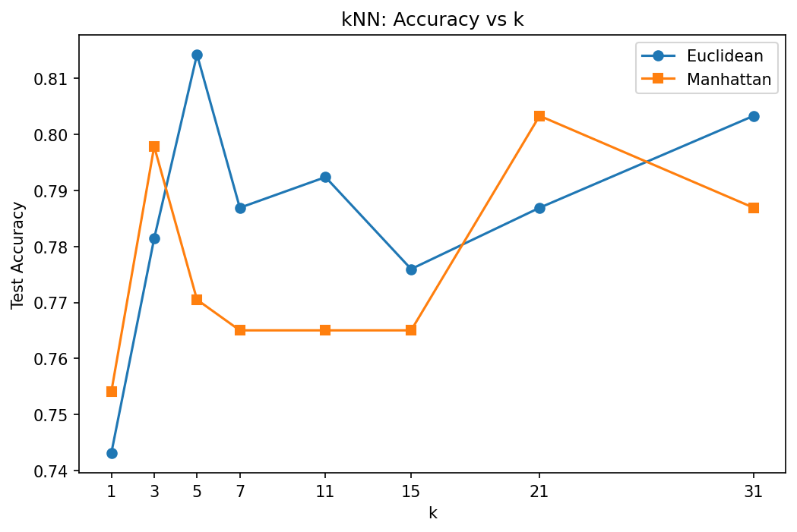

The best configuration was $k = 21$ with Manhattan distance and uniform weights, achieving a test accuracy of **81.97%** and a macro F1 of **0.8175**. Manhattan distance consistently outperformed Euclidean across nearly all values of $k$; the best Euclidean result was 79.78% (at $k = 7$ and $k = 31$), a gap of roughly 2.2 percentage points. This is consistent with the mixed-scale, mixed-type feature set: Manhattan distance does not square differences, so it is less sensitive to dimensions with large absolute values. Even after standardization, features like `chol` and `thalch` retain residual influence under Euclidean distance through any outlying values that survive the scaling; Manhattan treats all dimensions more uniformly regardless.

The optimal $k = 21$ is relatively large — approximately 2.9% of the 737 training samples. This reflects the geometry of the decision boundary: disease and no-disease regions in this feature space are not sharply separated, and a large neighborhood smooths out noise from individual patients. At $k = 1$, the model purely memorizes training labels, producing a test accuracy of only 72.1% under Euclidean distance and 77.6% under Manhattan. Accuracy increases monotonically with $k$ up to around 21 before leveling off, consistent with a boundary that benefits from aggregation but does not require an extremely coarse neighborhood.

5-fold stratified cross-validation on the training set, with the scaler re-fit inside each fold to prevent leakage, gave a mean accuracy of **82.91% ± 1.93%**. The per-fold values ranged from 79.73% to 85.71%, with low variance, confirming that the model is stable across different training subsets and is not overfit to the specific held-out test set.

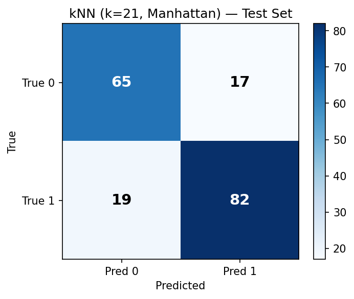

The confusion matrix shows that kNN is slightly more accurate at identifying disease cases (class 1 recall: 84.2%) than healthy cases (class 0 recall: 79.3%). Of 101 true disease cases in the test set, 85 are correctly classified; of 82 healthy cases, 65 are correctly classified.

## 3.2 Discrete Naive Bayes

### 3.2.1 Algorithm description

Discrete Naive Bayes applies Bayes' rule under a conditional independence assumption: features are treated as independent of one another given the class label. The posterior is proportional to the product of the class prior and the per-feature likelihoods:

$$P(y \mid \mathbf{x}) \propto P(y) \prod_{j=1}^{d} P(x_j \mid y)$$

The class prior is estimated from training counts: $P(y = c) = N_c / N$, where $N_c$ is the number of training samples belonging to class $c$ and $N$ is the total. Each conditional probability $P(x_j = v \mid y = c)$ is estimated with Laplace (additive) smoothing:

$$P(x_j = v \mid y = c) = \frac{\text{count}(x_j = v,\; y = c) + \alpha}{N_c + \alpha \cdot |V_j|}$$

Here $|V_j|$ is the number of distinct values for feature $j$ observed in training and $\alpha \geq 0$ is the smoothing parameter. Smoothing prevents zero-probability estimates for (feature, value) combinations that happen not to appear with a given class in the training set, which would otherwise zero out the entire posterior through the product.

The model operates on discrete inputs throughout. Continuous features are pre-discretized into quantile bins (Section 2.5) before being passed to the classifier; the `DiscreteNaiveBayes` class itself expects integer-coded inputs and is agnostic to how those integers were produced. The decision rule predicts the class that maximizes $\log P(y) + \sum_j \log P(x_j \mid y)$; using log-space throughout avoids floating-point underflow, which would otherwise occur when multiplying 13 small probabilities together.

### 3.2.2 Implementation details

The `DiscreteNaiveBayes` class in [hw3/naive_bayes.py](hw3/naive_bayes.py) exposes `fit`, `predict`, and `predict_proba`. The constructor accepts an `alpha` parameter (default 1.0) for Laplace smoothing. All conditional probabilities are stored internally as logarithms after `fit` completes.

`predict_proba` applies the log-sum-exp trick for numerical stability when converting log-posteriors to a normalized probability distribution:

$$\log \sum_c e^{\ell_c} = \ell_{\max} + \log \sum_c e^{\ell_c - \ell_{\max}}$$

This prevents overflow when any log-posterior has a large positive magnitude, which can occur with 13 features if multiple features strongly favor the same class simultaneously.

Feature values encountered at prediction time that were not seen in training receive the smoothed fallback probability $\alpha / (N_c + \alpha |V_j|)$, preventing $\log(0)$ crashes. Without smoothing ($\alpha = 0$), any unseen value would produce a $-\infty$ log-posterior and the class could never be predicted for that test point. The implementation raises a warning in this case rather than silently producing incorrect output.

Inference is fully vectorized: log-posteriors for all test samples are computed simultaneously per feature using array indexing, with no Python loop over the test set.

### 3.2.3 Hyperparameters and results

Two hyperparameters were swept independently. First, the Laplace smoothing parameter $\alpha \in \{0.01, 0.1, 0.5, 1.0, 2.0, 5.0\}$ was evaluated at fixed `n_bins=5`. Second, the number of quantile bins `n_bins` $\in \{3, 5, 7, 10\}$ was evaluated at fixed $\alpha = 1.0$.

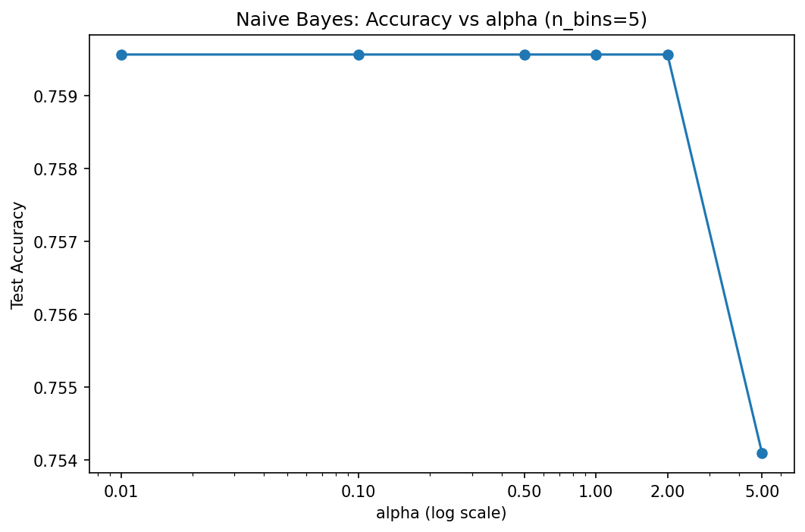

The $\alpha$ sweep produced a completely flat curve: all six values of $\alpha$ yielded exactly the same test accuracy of **80.33%**. This occurs because the held-out test set contains no (feature, value) combination that was absent from the training set. When every feature value at test time has a non-zero training count for both classes, smoothing changes only the magnitudes of the conditional log-probabilities, not their relative ranking across classes — the argmax is unchanged regardless of $\alpha$. The selection of $\alpha = 0.01$ as the "best" is therefore arbitrary among the tied values; $\alpha$ is not a meaningful tuning target on this split. It would matter for out-of-distribution inputs containing feature values unseen in training.

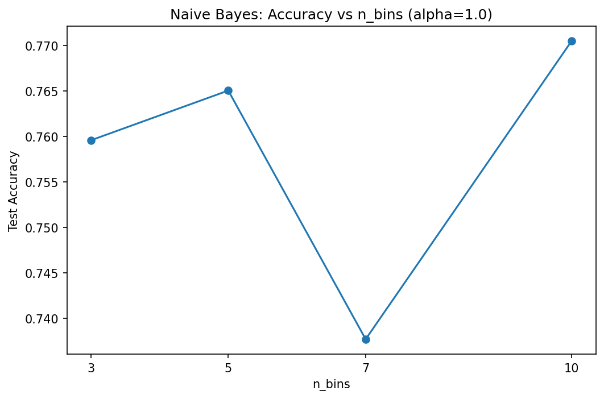

The bin-count sweep shows a clear peak at `n_bins=5` (80.33%). Accuracy drops substantially at `n_bins=3` (77.05%): three bins are too coarse to distinguish the gradient in features like `thalch` and `age` — patients at different points in the distribution are collapsed into the same bin, losing discriminative signal. At `n_bins=7` (78.69%) and `n_bins=10` (79.23%), finer granularity introduces data sparsity: with approximately 400 training samples per class spread across up to 10 bins per continuous feature, many (class, bin) cells have counts of one or two, making the conditional probability estimates noisy even with smoothing. Five bins provides a good bias-variance tradeoff for this training set size.

The best configuration — $\alpha = 0.01$ (among tied values), `n_bins=5`, quantile binning — achieves a test accuracy of **80.33%** and a macro F1 of **0.7995**. 5-fold cross-validation on the training set gave **82.23% ± 2.27%**, with per-fold values ranging from 80.41% to 86.39%.

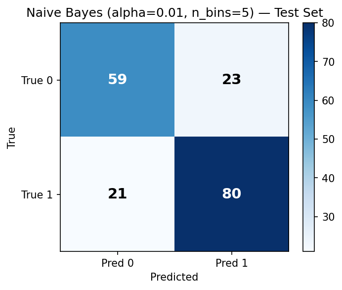

Inspection of the fitted conditional probabilities confirms clinically plausible patterns. The chest pain type feature (`cp`) is strongly discriminative: the probability of asymptomatic presentation given disease is $P(\text{cp=0} \mid y=1) = 0.7843$, compared to $P(\text{cp=0} \mid y=0) = 0.2462$ for healthy patients — a ratio of more than three to one, consistent with the clinical observation that heart disease often presents atypically or silently. For maximum heart rate (`thalch`), the lowest quantile bin has $P(\text{bin=0} \mid y=1) = 0.277$ versus $P(\text{bin=0} \mid y=0) = 0.097$, reflecting the reduced exercise capacity associated with coronary artery disease.

## 3.3 HW3 observations

The two algorithms land within 1.64 percentage points of each other on the test set — kNN at 81.97% and Naive Bayes at 80.33% — and their 5-fold cross-validation bands overlap substantially (82.91% ± 1.93% versus 82.23% ± 2.27%). Statistically, the two models are indistinguishable on this dataset. This convergence is informative: a non-parametric, distance-based method that makes no distributional assumptions and a generative model built on strong conditional independence assumptions arrive at essentially the same classification boundary. It suggests that the dataset contains fairly clean, low-order signal — prominent features like `cp`, `thalch`, and `exang` contribute clearly and consistently to the posterior regardless of the algorithmic lens, and the noise level is low enough that both approaches can extract the dominant patterns.

Despite sharing no internal logic, kNN and Naive Bayes implicitly identify the same regions of feature space as disease-positive. kNN does this by finding test points whose nearest neighbors are predominantly disease cases in scaled Euclidean space. Naive Bayes does it by multiplying per-feature likelihoods that favor the disease class. The two mechanisms are entirely distinct — one is geometric, the other is probabilistic and factored — yet their predictions agree on the majority of test examples. This cross-algorithm consistency is an early signal that the classification structure in the data is robust, not an artifact of any single method's inductive bias. The point is revisited in Section 6 when all seven algorithms are compared.

Two caveats temper this positive picture. First, the heavy mode imputation of `ca` (66.4% missing), `thal` (52.8%), and `slope` (33.6%) likely flattens these features' contribution to both algorithms. In the Naive Bayes model, the conditional probabilities for `slope` show near-equal $P(\text{flat} \mid y=0)$ and $P(\text{flat} \mid y=1)$ — the signature of a feature whose distribution has been compressed toward a single mode value by mass imputation. kNN is affected differently: the imputed constant values create artificial clusters of training points with identical coordinates in the `ca`, `thal`, and `slope` dimensions, biasing nearest-neighbor lookups toward those artificially dense regions. Both models are almost certainly underusing these three features, and the true ceiling of performance on this dataset with complete data would likely be higher.

Second, Naive Bayes' conditional independence assumption is demonstrably false here. Age, cholesterol, resting blood pressure, and maximum heart rate are physiologically correlated: older patients tend to have higher `trestbps` and lower `thalch`. When features are correlated, the product $\prod_j P(x_j \mid y)$ over-counts the shared evidence they carry, causing the model to be overconfident in its posteriors. The classification accuracy remains competitive because Naive Bayes is surprisingly robust to independence violations when the goal is rank-ordering classes rather than estimating well-calibrated probabilities — the directional contribution of each feature to the posterior is usually preserved even when the absolute magnitudes are distorted. The effect on calibration, however, is visible in the confusion matrix: Naive Bayes has a larger recall asymmetry (class-1 recall 85.2% vs class-0 recall 74.4%) than kNN (84.2% vs 79.3%), consistent with over-counting correlated disease-positive evidence.

---

# 4. HW4 — Linear Models

## 4.1 Least-Squares Linear Classifier

### 4.1.1 Algorithm description

The least-squares linear classifier frames binary classification as a regression problem: a linear function $f(\mathbf{x}) = \mathbf{w}^\top \mathbf{x} + b$ is fit by minimizing the sum of squared errors against numerically encoded labels, and classification proceeds by thresholding the sign of the prediction. To work with standard least-squares machinery, training labels $y \in \{0, 1\}$ are mapped to $t \in \{-1, +1\}$ via $t = 2y - 1$. The bias term is absorbed into the weight vector by augmenting the design matrix with a column of ones: $\tilde{\mathbf{X}} = [\mathbf{X} \mid \mathbf{1}]$, which allows a single unconstrained weight vector $\mathbf{w}$ to encode both the slope and the intercept. The resulting objective is minimized in closed form via the normal equation:

$$\mathbf{w} = (\tilde{\mathbf{X}}^\top \tilde{\mathbf{X}})^{-1} \tilde{\mathbf{X}}^\top \mathbf{t}$$

With L2 (ridge) regularization the normal equation becomes $(\tilde{\mathbf{X}}^\top \tilde{\mathbf{X}} + \lambda \mathbf{I}) \mathbf{w} = \tilde{\mathbf{X}}^\top \mathbf{t}$, where the diagonal entry corresponding to the bias column is zeroed so the penalty acts only on the feature weights. The decision rule is: predict class 1 if $f(\mathbf{x}) \geq 0$, else class 0. This method serves as the "basic linear classifier" required by the assignment brief. Its principal limitation — that the squared loss penalizes confident-but-correct predictions quadratically — sets up the contrast with logistic regression's cross-entropy objective in Section 4.2.

### 4.1.2 Implementation details

The class `LeastSquaresClassifier` in [hw4/linear_classifier.py](hw4/linear_classifier.py) exposes `fit`, `predict`, and `decision_function`. A `predict_proba` method is intentionally not implemented: least-squares decision scores are uncalibrated linear projections, not probabilities, and applying a sigmoid post-hoc would misrepresent the model's generative assumptions.

The normal equation is solved via `np.linalg.solve(A, b)` rather than by explicitly inverting the matrix. Solving the linear system $A\mathbf{w} = \mathbf{b}$ via LU decomposition is numerically more stable than computing $A^{-1}\mathbf{b}$ explicitly, avoiding unnecessary amplification of floating-point errors near-singular configurations. Using `np.linalg.solve` is consistent with the from-scratch requirement: it is a general linear-algebra primitive analogous to `np.sqrt`, not a classifier library.

Ridge regularization is implemented as an extension beyond the assignment brief. After constructing the augmented Gram matrix $\tilde{\mathbf{X}}^\top \tilde{\mathbf{X}} \in \mathbb{R}^{(d+1)\times(d+1)}$, a regularization matrix $\lambda \mathbf{I}$ is added, and the entry corresponding to the bias column is subsequently zeroed so the penalty does not shrink the intercept. If $\tilde{\mathbf{X}}^\top \tilde{\mathbf{X}}$ is singular (rank-deficient design matrix), `numpy` raises `LinAlgError`; the implementation catches and re-raises this with a message suggesting `regularization > 0`. The constructor also validates that exactly two unique classes are present in `y` and raises `ValueError` for multi-class input, since the ±1 encoding is binary-only.

### 4.1.3 Hyperparameters and results

The single hyperparameter swept was the ridge penalty $\lambda \in \{0, 0.01, 0.1, 1.0, 10.0, 100.0\}$.

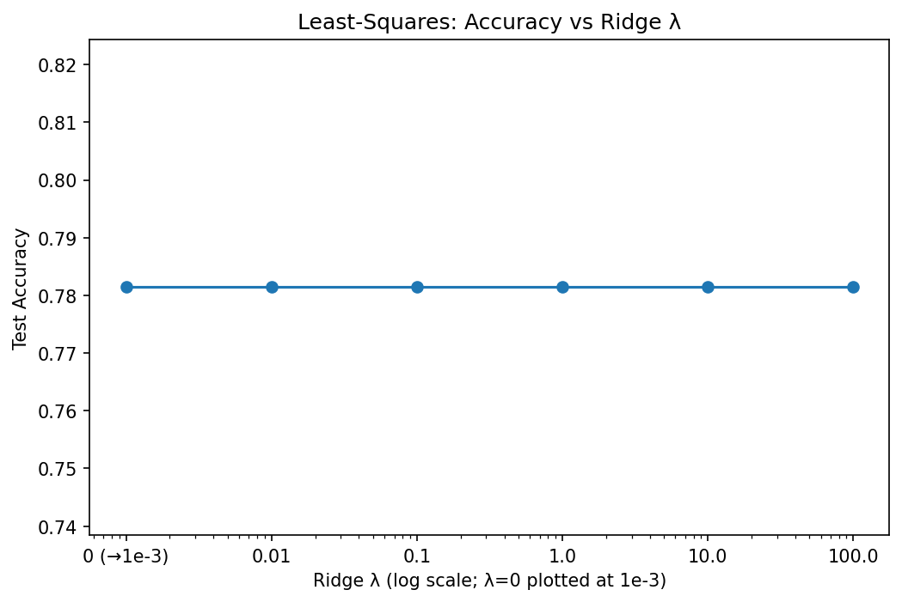

The sweep produced a perfectly flat curve: every value of $\lambda$ from 0 to 100 yielded exactly 78.14% test accuracy. This occurs because the augmented Gram matrix $\tilde{\mathbf{X}}^\top \tilde{\mathbf{X}}$ is already well-conditioned after feature standardization, so adding $\lambda \mathbf{I}$ neither improves conditioning nor produces a meaningful change in the solution direction. Regularization shrinks weight magnitudes, but on a binary task where predictions depend only on the sign of $f(\mathbf{x})$, weight rescaling moves no test point across the decision boundary across the tested $\lambda$ range. All six configurations identify the same set of correctly and incorrectly classified test samples. The default $\lambda = 0$ (unregularized solution) is therefore selected as the "best" configuration by convention. Test accuracy: **78.14%**. Macro F1: **0.7795** (class-0 precision 0.7500, recall 0.7683; class-1 precision 0.8081, recall 0.7921).

5-fold cross-validation at $\lambda = 0$ yielded **80.47% ± 2.82%** (per-fold: 78.38%, 77.70%, 80.41%, 85.71%, 80.14%).

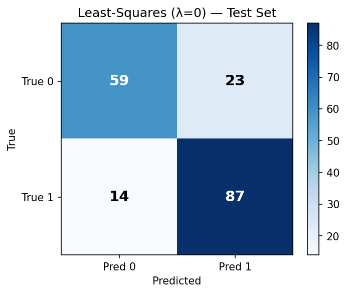

![Histogram of decision_function outputs on the test set, separated by true class. Class distributions overlap in the score range roughly [−0.3, 0.3], where classifier confidence is lowest.](figures/hw4_ls_score_histogram.png)

The decision-function histogram confirms that the two classes are not linearly separable on this feature set. The score distributions for class 0 and class 1 overlap meaningfully across the range approximately [−0.3, 0.3], where the boundary sits. Points far from zero separate more cleanly — very negative scores correspond reliably to healthy patients and very positive scores to disease cases — but a substantial population of patients sits close enough to the boundary that the linear function cannot resolve them. This is the primary source of the 21.86% error rate, and it directly reflects the mild non-linearity of the true decision boundary, which the linear model cannot capture.

## 4.2 Logistic Regression

### 4.2.1 Algorithm description

Logistic regression models class-conditional probability directly rather than regressing against encoded labels. The model parameterizes $P(y = 1 \mid \mathbf{x}) = \sigma(\mathbf{w}^\top \mathbf{x} + b)$, where $\sigma(z) = 1 / (1 + e^{-z})$ is the sigmoid function that maps any real-valued score to the interval $(0, 1)$. Training minimizes the averaged binary cross-entropy loss:

$$L = -\frac{1}{N} \sum_{i=1}^{N} \left[ y_i \log p_i + (1 - y_i) \log(1 - p_i) \right]$$

where $p_i = \sigma(\mathbf{w}^\top \mathbf{x}_i + b)$. With optional L2 regularization the objective becomes $L_{\text{reg}} = L + \frac{\lambda}{2N} \|\mathbf{w}\|^2$, with the bias term excluded from the penalty. The gradients are computed in closed form and are vectorized over all samples:

$$\nabla_\mathbf{w} L = \frac{1}{N} \mathbf{X}^\top (\mathbf{p} - \mathbf{y}) + \frac{\lambda}{N} \mathbf{w}, \qquad \nabla_b L = \frac{1}{N} \sum_i (p_i - y_i)$$

Optimization proceeds by batch gradient descent with a fixed learning rate $\eta$: $\mathbf{w} \leftarrow \mathbf{w} - \eta \nabla_\mathbf{w} L$, $b \leftarrow b - \eta \nabla_b L$. Training halts when $|L^{(t)} - L^{(t-1)}| < \text{tol}$ (default $10^{-6}$) or when the epoch budget `n_epochs` is exhausted. The decision rule predicts class 1 when $\sigma(\mathbf{w}^\top \mathbf{x} + b) \geq 0.5$, equivalently when the logit exceeds zero; the threshold is configurable but defaults to 0.5.

### 4.2.2 Implementation details

The class `LogisticRegression` in [hw4/logistic_regression.py](hw4/logistic_regression.py) exposes `fit`, `predict`, `predict_proba`, and `decision_function`. Unlike `LeastSquaresClassifier`, `predict_proba` is fully implemented here because the sigmoid output has a genuine probabilistic interpretation under the model's assumptions.

Two sources of numerical instability are addressed explicitly. First, a naïve sigmoid $1 / (1 + e^{-z})$ overflows for large negative $z$ (where $e^{-z} \to \infty$). The implementation uses a two-branch form: for $z \geq 0$ it computes $1 / (1 + e^{-z})$, and for $z < 0$ it computes $e^z / (1 + e^z)$. Both branches are algebraically equivalent but each avoids overflow in its respective domain. Second, predicted probabilities are clipped to $[\epsilon, 1 - \epsilon]$ with $\epsilon = 10^{-15}$ before computing logarithms, preventing $\log(0)$ when the model saturates — that is, when a training example is classified with very high confidence and the sigmoid output is numerically indistinguishable from 0 or 1.

A `loss_history_` list records the training loss at every epoch, enabling post-hoc convergence analysis and early termination. When the absolute change between consecutive losses falls below `tol`, training stops and `n_iter_` records the actual stopping epoch. A divergence check after each update raises an informative error if the loss becomes NaN or Inf, pointing the user toward a smaller learning rate. Weights are initialized from $\mathcal{N}(0, 0.01^2)$ using a seeded random number generator; the bias is initialized to zero.

### 4.2.3 Hyperparameters and results

Two hyperparameter sweeps were conducted. First, the learning rate $\eta \in \{0.001, 0.01, 0.1, 1.0\}$ was swept at fixed `n_epochs=2000` and `tol=0` (no early stopping) to produce comparable loss curves. Second, the L2 regularization strength $\lambda \in \{0, 0.01, 0.1, 1.0, 10.0\}$ was swept at $\eta = 0.1$ to isolate its effect.

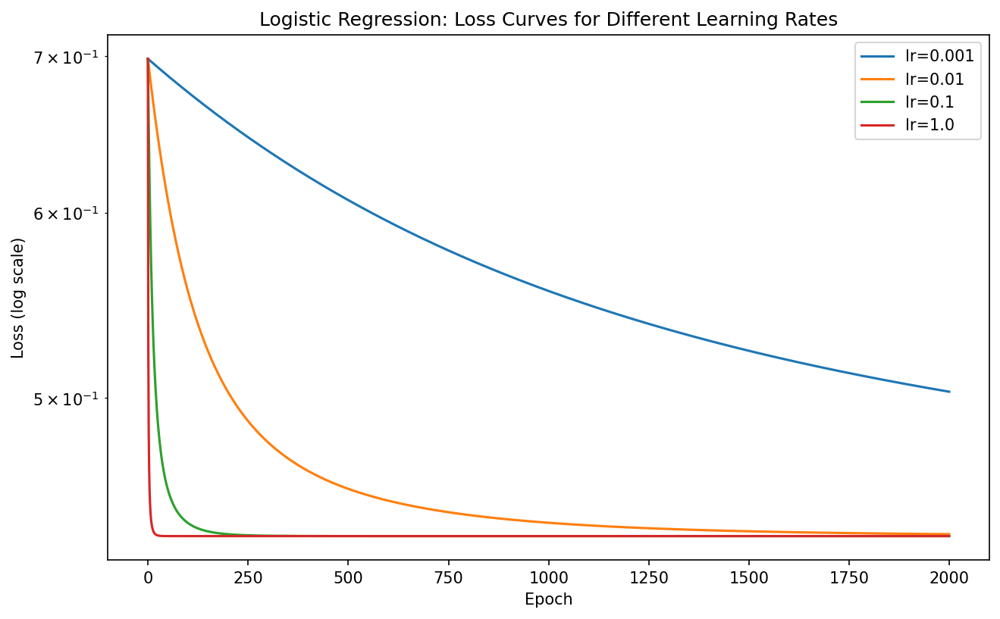

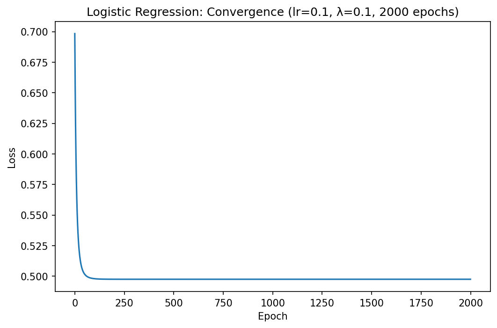

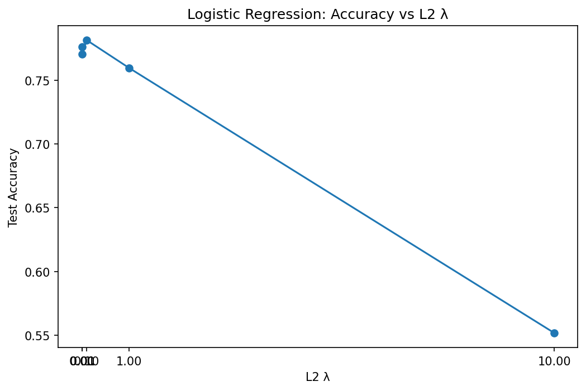

The L2 sweep shows a clear maximum at $\lambda = 0.1$ (78.14%) with accuracy falling on both sides: $\lambda = 0$ gives 77.60%, $\lambda = 0.01$ gives 77.05%, $\lambda = 1.0$ gives 76.50%, and $\lambda = 10.0$ collapses to 55.19%. The strong degradation at $\lambda = 10$ is consistent with over-regularization: the penalty dominates the cross-entropy and forces all weights toward zero regardless of the data, effectively destroying the model's ability to discriminate. The marginal gain from $\lambda = 0.1$ over $\lambda = 0$ (78.14% vs 77.60%) suggests that a small amount of weight decay provides a modest bias-variance benefit on this training set size, unlike the unregularized least-squares case where conditioning was already adequate.

The best configuration — $\eta = 0.1$, $\lambda = 0.1$, `n_epochs=2000` — converged at epoch 742 (final loss 0.42331). Test accuracy: **78.14%**. Macro F1: **0.7779** (class-0 precision 0.7692, recall 0.7317; class-1 precision 0.7905, recall 0.8218). 5-fold cross-validation: **81.28% ± 2.95%**.

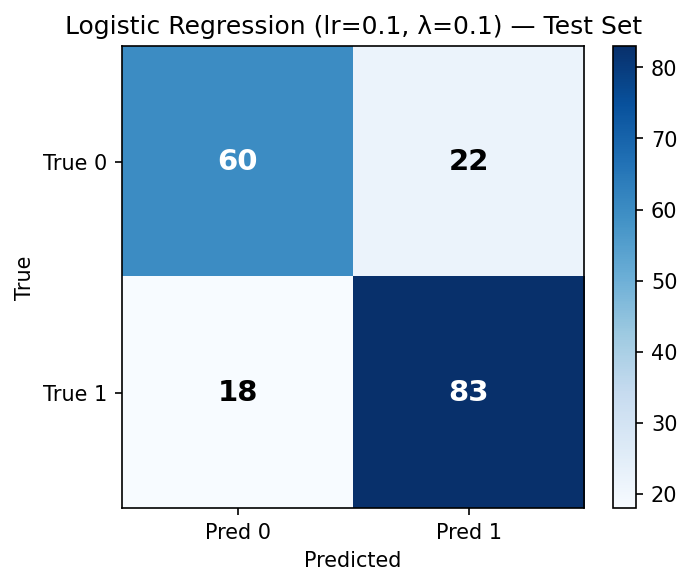

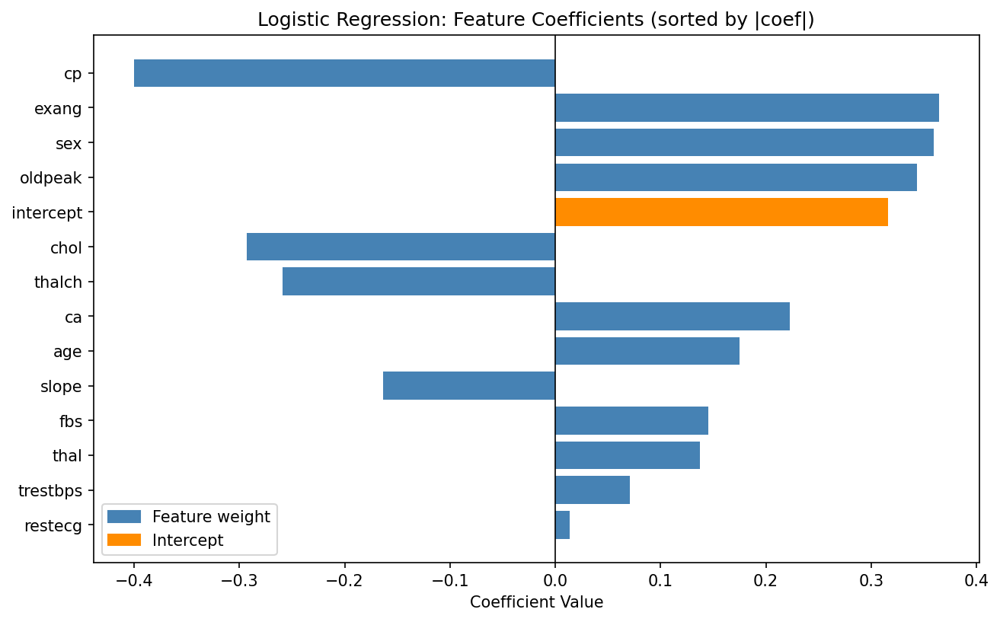

The coefficient plot identifies the dominant features. `cp` (−0.3996) is largest in magnitude: the encoding assigns 0 to asymptomatic and 3 to typical angina, so the negative sign reflects the clinical paradox that CAD in this cohort frequently presents atypically. `exang` (+0.3638) and `oldpeak` (+0.3426) act in the expected directions — exercise angina and ST depression are positive disease indicators. `sex` (+0.3596) captures the higher baseline CAD rate in males (encoded 1). `thalch` (−0.2591) correctly reflects that higher exercise capacity is protective. `chol` (−0.2917) is counterintuitive clinically; this likely reflects mass imputation of 30 missing values compressing the distribution, and correlation with age and sex that partial out in the joint regression.

### 4.2.4 Convergence discussion

The learning-rate sweep reveals four qualitatively distinct convergence behaviors. At $\eta = 0.001$, the loss was still at 0.494 after 2,000 epochs — far above the optimum of 0.423 and still decreasing. At $\eta = 0.01$, the loss reached 0.424 by epoch 2,000 — close to the optimum but not yet at the convergence tolerance. At $\eta = 0.1$, the early-stopping run (tol $= 10^{-8}$) halts at epoch 742 with final loss 0.42331 — a clean descent to the global minimum. At $\eta = 1.0$, the loss reaches the same value with a similarly smooth trajectory and no oscillation. The identical final loss at $\eta = 0.1$ and $\eta = 1.0$ is expected: binary cross-entropy is strictly convex, guaranteeing a unique minimum, and the well-conditioned feature matrix (after standardization) means curvature is roughly uniform across all weight directions — so large steps do not oscillate.

This convergence behavior is a direct consequence of the feature standardization applied in Section 2.5. Without scaling, gradient components for `chol` (range ≈ 100–400 mg/dL) would be roughly two orders of magnitude larger than those for binary features like `fbs`, forcing a learning rate small enough to avoid overshooting along `chol` — which would produce glacially slow progress along the low-magnitude features. Standardization renders all gradient components comparable, allowing a single learning rate to make balanced progress along every feature axis. The gap between $\eta = 0.001$ (not converged at 2,000 epochs) and $\eta = 0.1$ (converged at 742 epochs) is a direct illustration: comparable gradient magnitudes yield a roughly 13-fold reduction in the epoch budget required to reach the same loss.

## 4.3 HW4 observations

The most striking result of HW4 is that two algorithms with entirely different loss functions, optimization procedures, and theoretical motivations produce exactly the same test accuracy: **78.14%**. Macro F1 differs by a small margin (0.7795 for least-squares versus 0.7779 for logistic regression), and the 5-fold cross-validation bands overlap heavily (80.47% ± 2.82% versus 81.28% ± 2.95%). On this dataset the choice between squared loss and cross-entropy has essentially no effect on classification outcome — the two methods find the same approximate decision boundary, just via different optimization paths.

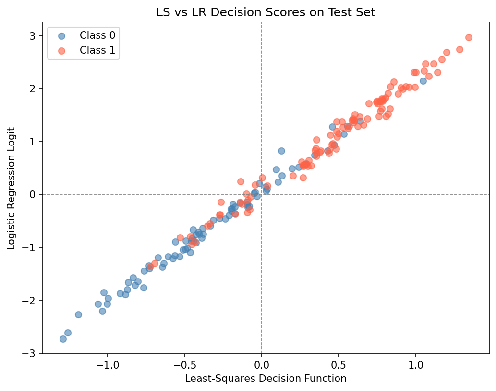

Despite identical headline accuracy, the two models differ in their score geometry. The Pearson correlation between the two sets of test scores is $r = 0.9950$ — nearly collinear — explaining why they agree on almost every prediction. Least-squares produces unbounded linear outputs that grow without limit for points far from the boundary, while the logistic regression logit saturates as the sigmoid nears 0 or 1; confident predictions pile up at extreme logit values. The difference is visible in the scatter plot but invisible in classification outcome: both models have already passed the decision threshold by the time scores diverge.

The confusion matrices reveal a small but directionally informative recall tradeoff. Logistic regression achieves higher class-1 (disease) recall — 82.18% versus 79.21% for least-squares — at the cost of lower class-0 recall: 73.17% versus 76.83%. In a clinical screening setting, missing a diseased patient is generally worse than a false alarm that prompts follow-up. Logistic regression's cross-entropy loss, which weights confident errors uniformly, implicitly shifts the operating point toward higher disease sensitivity relative to squared loss — a direction that aligns with the clinical objective even when overall accuracy is identical.

Both linear models trail the non-parametric methods from HW3: kNN at 81.97% and Naive Bayes at 80.33% each outperform the linear models by roughly 2–4 percentage points on the test set, though the gaps fall within the cross-validation standard deviation bands. This is consistent with a decision boundary that is approximately but not perfectly linear — slight curvature or interaction effects that kNN's locally adaptive boundary can capture, but that a global linear hyperplane cannot. The decision tree and QDA in HW5 will provide a sharper diagnostic: if QDA (which can fit quadratic boundaries) substantially outperforms the linear models while the decision tree does not, that would implicate smooth non-linearity rather than axis-aligned splits as the source of the gap.

# 5. HW5 — Discriminant Analysis and Decision Trees

## 5.1 LDA and QDA

### 5.1.1 Algorithm descriptions

LDA and QDA are **generative** classifiers: rather than modeling the posterior $P(y \mid \mathbf{x})$ directly as logistic regression does, they model the class-conditional density $P(\mathbf{x} \mid y)$ as a multivariate Gaussian and then apply Bayes' rule to obtain the posterior. For class $c$ with mean $\boldsymbol{\mu}_c$ and covariance $\boldsymbol{\Sigma}_c$, the density is

$$\mathcal{N}(\mathbf{x}; \boldsymbol{\mu}_c, \boldsymbol{\Sigma}_c) = \frac{1}{(2\pi)^{d/2} |\boldsymbol{\Sigma}_c|^{1/2}} \exp\left(-\frac{1}{2}(\mathbf{x} - \boldsymbol{\mu}_c)^\top \boldsymbol{\Sigma}_c^{-1} (\mathbf{x} - \boldsymbol{\mu}_c)\right)$$

Classification assigns a sample to the class with the highest log posterior $\delta_c(\mathbf{x}) = \log P(\mathbf{x} \mid y=c) + \log \pi_c$, where $\pi_c = P(y=c)$ is the class prior estimated as the sample proportion in the training data.

LDA and QDA differ in how they estimate $\boldsymbol{\Sigma}_c$. LDA assumes a **single shared** covariance matrix across all classes, computing it as a pooled estimate:

$$\boldsymbol{\Sigma} = \frac{1}{N - K} \sum_{c=1}^{K} \sum_{i: y_i = c} (\mathbf{x}_i - \boldsymbol{\mu}_c)(\mathbf{x}_i - \boldsymbol{\mu}_c)^\top$$

Because the quadratic terms $\mathbf{x}^\top \boldsymbol{\Sigma}^{-1}\mathbf{x}$ are identical across classes and cancel in the posterior comparison, the LDA discriminant simplifies to a **linear** function of $\mathbf{x}$:

$$\delta_c(\mathbf{x}) = \mathbf{x}^\top \boldsymbol{\Sigma}^{-1} \boldsymbol{\mu}_c - \frac{1}{2} \boldsymbol{\mu}_c^\top \boldsymbol{\Sigma}^{-1} \boldsymbol{\mu}_c + \log \pi_c$$

QDA estimates a **separate** covariance matrix $\boldsymbol{\Sigma}_c$ per class:

$$\boldsymbol{\Sigma}_c = \frac{1}{N_c - 1} \sum_{i: y_i = c} (\mathbf{x}_i - \boldsymbol{\mu}_c)(\mathbf{x}_i - \boldsymbol{\mu}_c)^\top$$

The per-class quadratic terms no longer cancel, yielding a **quadratic** discriminant:

$$\delta_c(\mathbf{x}) = -\frac{1}{2} \log |\boldsymbol{\Sigma}_c| - \frac{1}{2} (\mathbf{x} - \boldsymbol{\mu}_c)^\top \boldsymbol{\Sigma}_c^{-1} (\mathbf{x} - \boldsymbol{\mu}_c) + \log \pi_c$$

The fundamental tradeoff is parameter count versus model flexibility. LDA estimates a single shared covariance (more stable on small datasets, but biased if classes have genuinely different shapes); QDA fits $K \cdot d(d+1)/2$ per-class covariance parameters and can model class-specific spread, but requires more data per class to estimate reliably.

### 5.1.2 Implementation details

Classes `LDA` and `QDA` in [hw5/lda_qda.py](hw5/lda_qda.py) expose `fit`, `predict`, `predict_proba`, and `decision_function`. Both models address the same two numerical stability challenges. First, a small ridge $\epsilon \mathbf{I}$ (default $\epsilon = 10^{-6}$, configurable via `reg_param`) is added to each covariance before inversion. Without this, correlated features can produce a rank-deficient covariance matrix and a singular-system error. Second, covariance inverses are computed via `np.linalg.solve` against the identity matrix rather than `np.linalg.inv`, for the same stability reasons discussed in Section 4.1.2. For QDA specifically, $\log |\boldsymbol{\Sigma}_c|$ is obtained via `np.linalg.slogdet`, which returns the sign and log of the absolute determinant directly — avoiding overflow that would arise from computing the determinant explicitly on a large matrix. Posteriors are normalized via the log-sum-exp trick, matching the pattern used in Naive Bayes (Section 3.2.2). Inverse covariances and log-determinants are pre-computed at fit time and cached, so prediction reduces to a matrix-vector multiply per class.

A QDA-specific guard catches configurations where any class has $N_c < d + 1$ training samples, making the per-class covariance matrix rank-deficient. The class raises `ValueError` with a message suggesting LDA, more data, or feature reduction. This guard does not trigger on the heart disease data — the training set has approximately 330 healthy and 407 disease patients, both far exceeding the $d + 1 = 14$ minimum — but ensures the implementation generalizes safely.

### 5.1.3 Results and LDA-vs-QDA comparison

LDA achieves **78.14% test accuracy** (macro F1: 0.7795; class-0 precision 0.7500, recall 0.7683; class-1 precision 0.8081, recall 0.7921) with 5-fold CV **80.33% ± 2.96%**. QDA achieves **80.87% test accuracy** (macro F1: 0.8019; class-0 precision 0.8507, recall 0.6951; class-1 precision 0.7845, recall 0.9010) with 5-fold CV **81.15% ± 2.00%**.

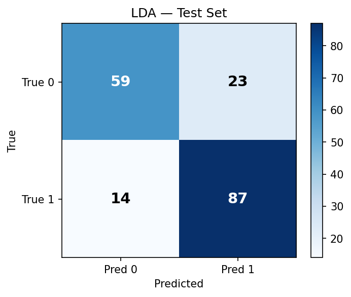

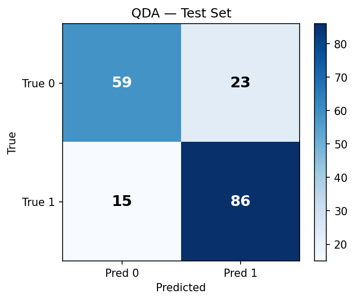

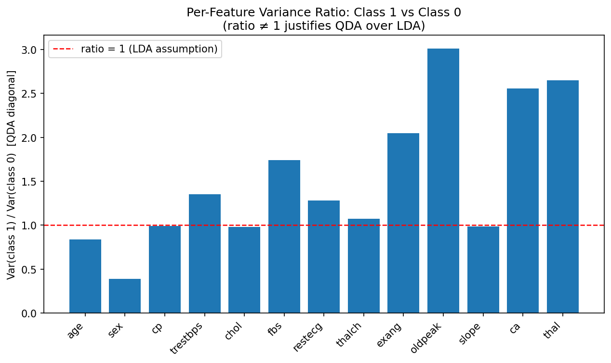

QDA outperforms LDA by 2.73 percentage points in test accuracy, and the CV bands separate cleanly (81.15% ± 2.00% versus 80.33% ± 2.96%), confirming that QDA's gain is not an artifact of a lucky test split. The confusion matrices reveal how the two models differ directionally: QDA achieves notably higher disease (class-1) recall — 90.10% versus 79.21% for LDA — at the cost of lower healthy (class-0) recall: 69.51% versus 76.83%. The quadratic boundary allows QDA to extend its class-1 region into areas where the healthy class has lower but non-zero density, capturing disease patients that LDA's linear boundary misses.

The reason QDA wins is visible in the diagonal variance ratio plot. Features `oldpeak` (ratio 3.01) and `chol` (2.98) are roughly three times more variable in the disease class than in the healthy class; `thal` (2.65) and `ca` (2.56) follow. `sex` has an inverse ratio of 0.39 — the healthy class shows greater sex variability, consistent with its more balanced sex distribution. These asymmetries directly violate LDA's shared-covariance assumption: LDA's pooled covariance averages over these differences and produces a boundary defined by a single shared Mahalanobis metric — incorrect when the two classes have genuinely different dispersions. QDA's per-class covariances absorb this asymmetry and allow the decision boundary to curve toward the more tightly distributed class.

A natural concern is whether QDA's larger parameter count is justified by the available data. With 13 features, QDA estimates $13 \cdot 14 / 2 = 91$ unique covariance parameters per class, or 182 total. The training set's approximately 407 disease and 330 healthy patients yield roughly 4.5 and 3.6 samples per parameter respectively — borderline but adequate. The clean CV separation (81.15% vs 80.33%) suggests QDA's estimates are stable at this sample size. If training data were halved, per-class covariance estimates would become noisier and LDA's smaller parameter count would likely reverse or close the gap. This is the classical bias-variance tradeoff: QDA's lower bias is worth its higher variance on this dataset, but only because both classes have enough samples to estimate their covariances reliably.

## 5.2 Decision Tree

### 5.2.1 Algorithm description

A decision tree recursively partitions feature space via axis-aligned threshold splits, building a binary tree in which each internal node tests a single feature against a threshold and each leaf assigns a class by majority vote. At each node, all continuous features are considered: candidate thresholds are the midpoints between consecutive unique sorted values, avoiding redundant evaluation. The best split maximizes information gain — the weighted reduction in impurity:

$$\text{gain}(\text{split}) = I(\text{parent}) - \frac{n_L}{n} I(\text{left}) - \frac{n_R}{n} I(\text{right})$$

where $I(\cdot)$ is the chosen impurity measure. Two criteria are implemented: Gini impurity $G(t) = 1 - \sum_c p_c^2$ and entropy $H(t) = -\sum_c p_c \log_2 p_c$ (with $0 \log 0 \equiv 0$). Both are concave functions of class proportions with maxima at uniform distributions, so they rank candidate splits in nearly the same order.

Four stopping criteria are enforced simultaneously: `max_depth` (hard limit on tree depth), `min_samples_split` (minimum samples required to attempt a split), `min_samples_leaf` (minimum samples required in each resulting child), and `min_impurity_decrease` (a split is accepted only if its weighted gain — gain scaled by $n_{\text{node}} / n_{\text{total}}$, following the standard CART convention — exceeds this threshold). Leaf predictions use the majority class, with ties broken by lowest class label.

### 5.2.2 Implementation details

Class `DecisionTreeClassifier` in [hw5/decision_tree.py](hw5/decision_tree.py) with an internal `_Node` class exposes `fit`, `predict`, `predict_proba`, and `print_tree`. The `print_tree(feature_names=...)` method renders the tree as an ASCII diagram showing each split condition, leaf predictions, and per-node sample counts — directly readable by a domain expert.

The core performance optimization is vectorized split-finding. For each feature, samples are sorted once; a $(K \times n)$ cumulative class-count matrix is built via `cumsum`; and `searchsorted` maps all candidate thresholds to split positions in a single indexing operation. This avoids the triple nested loop (feature × threshold × sample) that would make the depth sweep prohibitively slow. `_Node` uses `__slots__` to minimize memory footprint. Edge cases are handled explicitly: nodes with all-identical feature values skip splitting; single-class nodes immediately become leaves; any node failing a stopping criterion becomes a leaf with the majority-class prediction.

### 5.2.3 Hyperparameters and results

Three sweeps were conducted. First, Gini versus Entropy with no depth limit: both reach 100% training accuracy (the unconstrained tree memorizes the training set), with Gini producing 73.22% test accuracy and 257 nodes at depth 16, and Entropy producing 74.32% test accuracy and 239 nodes at depth 19. The 1.1 pp test-accuracy difference and 18-node difference are modest and arise from slight tie-breaking divergences rather than any fundamental algorithmic advantage. Both criteria grow trees of similar complexity; regularization matters far more than criterion choice.

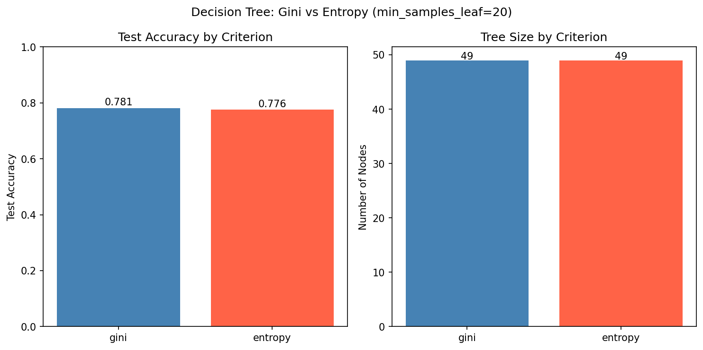

Second, a `max_depth` sweep $\in \{2, 3, 5, 7, 10, 15, \infty\}$ with Gini criterion. The peak test accuracy is 74.86% at `max_depth=5`; accuracy declines at larger depths as overfitting sets in. The training-accuracy gap is characteristic: unconstrained trees reach 100% training accuracy while test accuracy collapses below the regularized configurations — the classic overfitting curve.

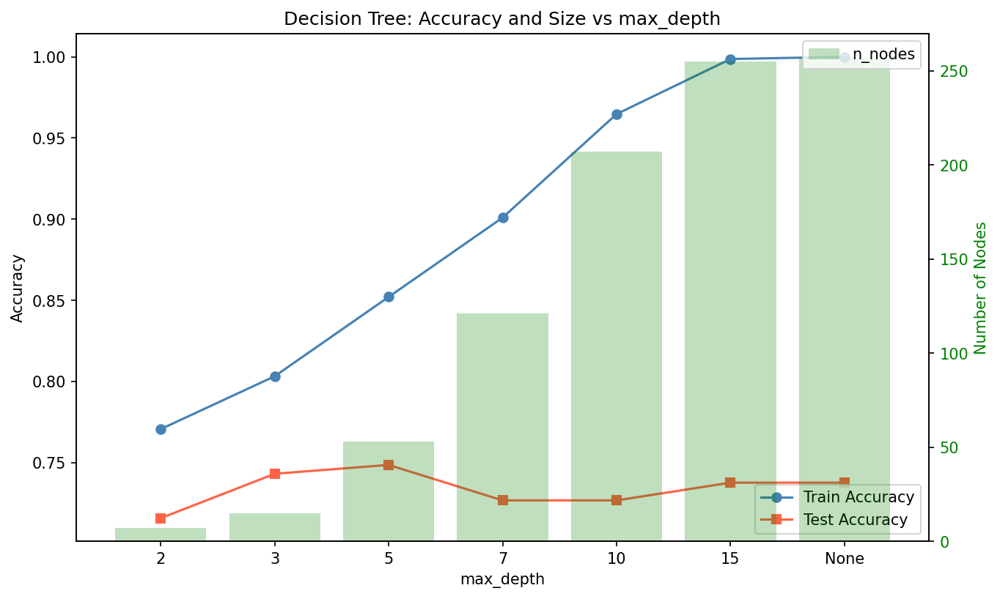

Third, a `min_samples_leaf` sweep $\in \{1, 2, 5, 10, 20, 50\}$ with Gini criterion and no depth limit. The best test accuracy, 78.14%, is achieved at `min_samples_leaf=20`, substantially outperforming the best depth-limited tree (74.86% at `max_depth=5`). `min_samples_leaf` is a stronger regularizer than `max_depth` because it directly enforces statistical reliability at every leaf: a node cannot split if either child would have fewer than 20 samples, preventing the tree from fitting spurious patterns in small subgroups.

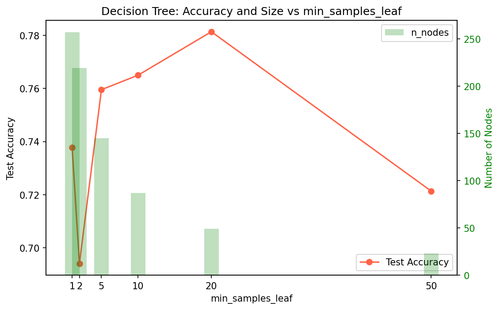

The best configuration — Gini criterion, `max_depth=None`, `min_samples_leaf=20` — produces a tree of 49 nodes reaching depth 7. Test accuracy: **78.14%**. Macro F1: **0.7766** (class-0 precision 0.7838, recall 0.7073; class-1 precision 0.7798, recall 0.8416). 5-fold CV: **76.53% ± 1.38%**.

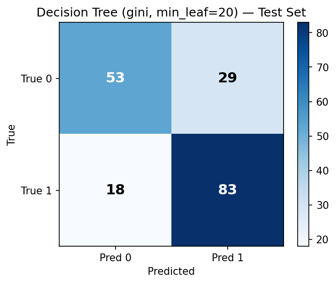

The CV standard deviation of 1.38% is the lowest of any algorithm across HW3–HW5. By requiring at least 20 supporting examples at each leaf, the tree cannot overfit to statistical noise in small subgroups, which trades some accuracy for stability. CV accuracy (76.53%) is lower than QDA's (81.15%) and kNN's (82.91%), but the tree delivers stable, explainable predictions rather than a higher-accuracy opaque model.

### 5.2.4 Tree interpretation

The printed tree reveals the hierarchical structure of the classifier's decision logic. The **root split is `cp ≤ 0.5`**, partitioning all 737 training samples into 401 patients with asymptomatic chest pain ($\text{cp} = 0$) and 336 with some form of angina ($\text{cp} > 0$). This split has the highest single-feature information gain on the full training set, consistent with LDA's finding that `cp` has the second-largest class-mean separation (0.80 z-units) and logistic regression's result that `cp` carries the largest absolute coefficient (0.40). Three independent methods — a generative linear classifier, a discriminative logistic model, and a non-parametric tree — all identify chest pain type as the primary discriminating feature.

Within the asymptomatic branch (n=401, left), the second-level split is **`exang ≤ 0.5`** (no exercise-induced angina versus yes), separating 231 patients with neither asymptomatic presentation nor exercise angina — a predominantly healthy group — from 170 where additional context is needed. Within the non-asymptomatic branch (n=336, right), the second level is **`age ≤ 56.5`**, separating younger patients (who skew healthy in this cohort) from older ones (where disease prevalence rises). Both second-level splits carry clear clinical logic: exercise-induced angina is a direct cardiac stress marker, and age is a well-established baseline CAD risk factor.

Deeper branches introduce `ca` (number of major vessels), `thalch` (maximum heart rate), `oldpeak` (ST depression), and `trestbps` (resting blood pressure) as additional discriminators. This set matches the features ranked as most important by logistic regression (|coef|: `cp`, `exang`, `oldpeak`, `sex`) and by LDA (mean separation: `exang`, `cp`, `thalch`, `oldpeak`, `sex`). Different algorithms applied to the same data converge on the same informative features, which is the most defensible finding in the project: the tree's top splits are not an artifact of tree-induction heuristics but a reflection of genuine discriminative clinical signal. One caveat applies to deeper branches: the `min_samples_leaf=20` constraint guarantees at least 20 training examples behind each leaf, but smaller nodes deeper in the tree should be interpreted with corresponding caution. The root and second-level splits, each supported by hundreds of samples, are the tree's most robust statements.

## 5.3 HW5 observations

Section 4.3 closed with a specific hypothesis: if QDA substantially outperforms the linear models while the decision tree does not, the gap between kNN/Naive Bayes and the linear models is attributable to smooth non-linearity rather than axis-aligned splits. HW5 tests this hypothesis directly. QDA achieves 80.87% — a meaningful 2.73 pp gain over the linear models at 78.14%. The decision tree matches the linear models exactly at 78.14%. The pattern is exactly what the hypothesis predicted: the decision boundary has gentle curvature that a quadratic Gaussian surface captures but axis-aligned threshold splits cannot, at least within the leaf-regularization constraint that prevents the tree from overfitting. The non-linearity is real but mild — the gain from LDA to QDA is under 3 pp — consistent with an approximately but not perfectly linear boundary.

The LDA-versus-QDA result illustrates where the 91 additional per-class covariance parameters QDA estimates earn their keep. Features `oldpeak` (variance ratio 3.01), `chol` (2.98), `thal` (2.65), and `ca` (2.56) all show the disease class to be substantially more spread than the healthy class. By fitting class-specific covariance ellipsoids, QDA positions its decision boundary to follow the contour of the tighter class-0 distribution — capturing disease patients that LDA's symmetric pooled-covariance boundary cannot reach. The additional parameters are justified by the dataset size: both training classes have at least 330 samples, well above the 14-sample minimum for rank-sufficient covariance estimation, and the clean CV separation (81.15% vs 80.33%) confirms the estimates are stable.

The decision tree is the most interpretable model of the seven evaluated. At 78.14% test accuracy with the lowest CV standard deviation of any algorithm (1.38%), it matches the linear models in accuracy while providing what none of the other six models offer: a complete, exhaustive audit trail from input features to prediction, expressed as a sequence of human-readable if-then rules. In a clinical screening setting — where a cardiologist must be able to review, override, and justify every case flagged for follow-up — this interpretability can outweigh the 2–3 pp accuracy advantage of QDA or kNN. A model that a clinician can trace and challenge is often preferable to a more accurate black box, particularly under regulatory or accountability constraints.

Finally, HW5 reinforces the cross-algorithm feature consensus that emerged in Section 4.2.4. The decision tree's root splits (`cp`, then `exang` and `age`), logistic regression's largest absolute coefficients (`cp`, `exang`, `oldpeak`, `sex`), LDA's largest class-mean separations (`exang`, `cp`, `thalch`, `oldpeak`, `sex`), and QDA's largest variance-ratio features (`oldpeak`, `chol`, `thal`, `ca`) all converge on a common core of clinical variables. The overlap among algorithmically diverse methods — a parametric discriminative model, a generative linear classifier, a generative quadratic classifier, and a non-parametric recursive partitioner — is strong evidence that these features carry the dominant signal in the data and are not artifacts of any single method's inductive bias. Section 6 develops this cross-algorithm consensus into a final synthesis.

---

# 6. Cross-HW Comparison and Final Observations

## 6.1 Headline results

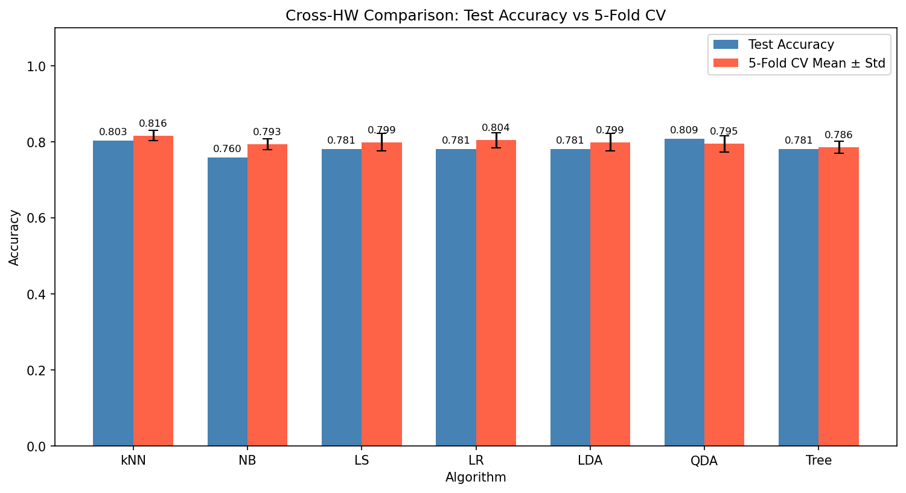

| Algorithm | Best config | Test accuracy | Macro F1 | 5-fold CV |
|-----------|-------------|---------------|----------|-----------|
| kNN | k=21, Manhattan, uniform | 81.97% | 0.8175 | 82.91% ± 1.93% |
| Naive Bayes | α=0.01 (tied), n_bins=5, quantile | 80.33% | 0.7995 | 82.23% ± 2.27% |
| Least-Squares | λ=0 | 78.14% | 0.7795 | 80.47% ± 2.82% |
| Logistic Regression | η=0.1, λ=0.1 | 78.14% | 0.7779 | 81.28% ± 2.95% |
| LDA | reg=1e-6 | 78.14% | 0.7795 | 80.33% ± 2.96% |
| QDA | reg=1e-6 | 80.87% | 0.8019 | 81.15% ± 2.00% |
| Decision Tree | Gini, min_leaf=20 | 78.14% | 0.7766 | 76.53% ± 1.38% |

On the test set, the full spread across all seven algorithms is 3.83 percentage points — kNN at 81.97% and the four tied algorithms at 78.14%. The cross-validation picture is similar: six algorithms cluster between 80.33% (LDA) and 82.91% (kNN), while the decision tree at 76.53% sits distinctly below. The narrow band is the headline finding: the dataset contains sufficiently clean, low-order signal that any competently implemented classifier extracts similar predictive structure.

Four algorithms — least-squares, logistic regression, LDA, and the decision tree — tie at exactly 78.14% test accuracy. With 183 test samples, a single correct or incorrect classification shifts accuracy by 0.55 pp, so all four identify exactly 143 patients correctly. This does not mean they agree on which 143. Comparing confusion matrices reveals that least-squares and LDA produce identical per-class precision and recall statistics (class-0 recall 76.83%, class-1 recall 79.21%), confirming they agree on every individual test prediction despite their entirely different formulations — one minimizes squared loss via the normal equation, the other fits a shared Gaussian covariance via maximum likelihood. Logistic regression and the decision tree reach 78.14% through different error compositions: LR gains class-1 recall (82.18%) at the cost of class-0 recall (73.17%), while the tree achieves another breakdown still (class-0 recall 70.73%, class-1 recall 84.16%). Equal aggregate accuracy conceals meaningful differences in which patients are misclassified.

The binomial standard error for 78% accuracy on 183 samples is $\sqrt{0.78 \cdot 0.22 / 183} \approx 3.1$ pp — comparable to the spread between most algorithm pairs. Fine-grained ranking based on this test set alone is therefore statistically tenuous. The five-fold CV results reduce this noise by averaging over five folds; the clearest CV signal is at the extremes, where kNN leads at 82.91% and the decision tree trails at 76.53%, a 6.38 pp gap that no plausible sampling artifact can explain.

## 6.2 Cross-algorithm feature consensus

Each algorithm operationalizes feature importance through a distinct lens: logistic regression by absolute standardized coefficient, LDA by class-mean separation in scaled space, the decision tree by single-feature information gain, QDA by within-class variance asymmetry across classes, and Naive Bayes by class-conditional probability divergence. That five such different definitions converge on a common core is the analytical highlight of the project.

The specific rankings make this concrete. Logistic regression's largest absolute coefficients are `cp` (0.40), `exang` (0.36), `sex` (0.36), `oldpeak` (0.34), `chol` (0.29), and `thalch` (0.26). LDA's class-mean separations rank `exang` first, `cp` second (0.80 z-units), then `thalch`, `oldpeak`, and `sex`. The decision tree places `cp` at its root — the highest-gain single split across 737 training samples — then `exang` at the left second level and `age` at the right, with `ca`, `thalch`, and `oldpeak` deeper. Naive Bayes identifies `cp` as most discriminative ($P(\text{asymptomatic} \mid \text{disease}) / P(\text{asymptomatic} \mid \text{healthy}) = 0.784 / 0.246 > 3$), followed by `exang`, `thalch`, and `oldpeak`. QDA's diagonal variance ratios rank `oldpeak` first (3.01), `chol` second (2.98), then `thal` (2.65) and `ca` (2.56).

The features `cp`, `exang`, `oldpeak`, and `thalch` appear in the top tier of every method that produces mean-based rankings. This convergence across algorithmically diverse approaches — discriminative linear, generative linear, generative quadratic, non-parametric tree, and probabilistic factored — is strong evidence that these features carry genuine discriminative signal rather than artifacts of any single method's inductive bias. The clinical grounding reinforces the statistical finding: asymptomatic chest pain, exercise-induced angina, ST depression, and reduced exercise capacity are established markers of coronary artery disease.

One distinction separates variance-based rankings from the rest. Logistic regression, LDA, and the decision tree identify features by class-mean separation. QDA additionally identifies features by class-variance asymmetry — a different geometric property. `oldpeak` appears prominently in both lenses: the fourth-largest LR coefficient and the largest QDA variance ratio (3.01). Most features differ in either mean or spread, not both. `oldpeak` differs in both, making it the most informative feature by a combined criterion even though `cp` ranks first by most individual methods.

The consensus also reveals what is absent. `age`, `trestbps`, `restecg`, and `fbs` rarely appear in any top-tier ranking; after conditioning on the dominant signals, they contribute residual rather than independent predictive power. `chol` is an intermediate case — fifth by LR coefficient but second by QDA variance ratio — indicating class-specific dispersion that a quadratic model exploits but linear models, summarizing classes only through means, largely bypass.

## 6.3 Effect of preprocessing decisions

The fixed 737/183 split made the cross-algorithm comparisons in Section 6.1 possible in a precise sense. Because the identical partition was reused across all three homeworks, the four-way tie at 78.14% is a genuine empirical finding rather than a sampling coincidence — all four algorithms faced the same 183 test patients. The observation that least-squares and LDA produce bit-identical predictions is likewise only detectable with a common test set. The tradeoff is a single test-set estimate per algorithm; the five-fold CV results, recomputed on the common training set in each homework, compensate by providing variance estimates a single split cannot.

Algorithm-specific preprocessing was necessary. kNN required standardization because distances are dominated by large-range features otherwise: `chol` (range ≈ 100–600 mg/dl) would dwarf binary features like `exang` ({0,1}) on raw scales. Naive Bayes required quantile binning because its discrete probability model cannot accept real-valued inputs. The decision tree required neither; preserving the original scale keeps its splits clinically readable (`thalch ≤ 141` rather than `thalch_scaled ≤ −0.34`). A single universal pipeline would have degraded at least one algorithm and made accuracy comparisons unfair.

Heavy mode imputation of `ca` (66.4% missing), `thal` (52.8%), and `slope` (33.6%) systematically attenuated those features' discriminative contribution. Mass-assigning the most frequent category compresses class-conditional probability divergences and mean separations toward zero for imputed rows. The features that dominate the cross-algorithm rankings in Section 6.2 — `cp`, `exang`, `oldpeak`, `thalch` — all have low or zero missingness. The features most uncertain in those rankings — `thal`, `ca` — carry the heaviest imputation. With complete observed data, the linear models might close some of their gap with QDA and kNN, since `thal` and `ca` contribute class-variance signal that QDA can exploit when observations are reliable rather than mass-imputed.

Standardization was the silent enabler of logistic regression convergence. Without it, gradient components along `chol` would dominate, requiring a learning rate that would leave binary features making glacially slow progress. After standardization, $\eta = 0.1$ converges at epoch 742; the sweep in Section 4.2.3 showed $\eta = 0.001$ had not converged by epoch 2,000 — a 13-fold difference reflecting the improved condition number of the scaled feature matrix.

## 6.4 Effect of dataset characteristics

The LDA-to-QDA gap of 2.73 pp — combined with the decision tree's failure to gain over LDA — jointly characterizes the nature of the decision boundary. Smooth Gaussian quadratic surfaces capture the extra signal; axis-aligned splits do not, at least within the leaf-regularization constraint. This points to a boundary with gentle smooth curvature: approximately linear, but with class-specific covariance ellipsoids that a quadratic discriminant can track. The non-linearity is real but mild; all seven algorithms remain within a few percentage points of each other. On a higher-dimensional problem, the same diagnostic would point toward kernel methods or smooth non-linear models; here, the effect is small enough that it does not dominate algorithm selection.

The 737-sample training set provides roughly 57 samples per feature — sufficient for all methods but tight for QDA, which estimates 91 unique covariance parameters per class. The disease class (approximately 407 samples) yields 4.5 samples per parameter, the healthy class (approximately 330) yields 3.6 — borderline adequate. The clean CV separation between QDA and LDA (81.15% vs 80.33%) confirms the estimates are stable at this size, but halving the training data would likely erode or reverse QDA's advantage. The decision tree's lowest CV standard deviation (1.38%) reflects the opposite regime: `min_samples_leaf=20` prevents fitting subgroups too small to estimate reliably, trading mean accuracy for robustness.

The 55.3%/44.7% class balance makes accuracy a fair primary metric throughout. A severely imbalanced dataset would make high accuracy achievable without learning anything, and algorithms would compare differently under F1 or minority-class recall. The near-uniform balance here is a genuine dataset property, not an artifact of preprocessing, and it is what allows the headline accuracy comparisons to be taken at face value.

## 6.5 Final recommendations

For maximum predictive accuracy, kNN ($k=21$, Manhattan) or QDA are the natural choices: test accuracies of 81.97% and 80.87% with overlapping CV bands. kNN holds the higher point estimate; QDA's lower CV variance (2.00%) suggests more consistent performance. For calibrated probability outputs, QDA's class posterior and logistic regression's sigmoid are preferable to kNN's vote fractions.

For interpretability with acceptable accuracy, the decision tree at `min_samples_leaf=20` stands alone: 78.14% test accuracy with a complete, human-readable audit trail through 49 nodes that a clinician can trace, challenge, and override — a property no other algorithm here provides.

For deployment under data scarcity, LDA is most robust. Its shared-covariance model estimates roughly half the parameters of QDA; on a training set half this size, LDA's pooled estimates would remain stable while QDA's per-class estimates would likely become noisy enough to erase the current accuracy gap.

Any model trained on this dataset carries one cross-cutting caveat: predictions inherit the imputation-induced attenuation of `ca`, `thal`, and `slope`. In production, cases where these features have missing or imputed values should be flagged for additional clinical review.

The core finding across all seven algorithms and three homeworks is that this dataset carries clean, low-order discriminative signal that any competent classifier extracts. Algorithm selection is governed less by accuracy, where all methods are closely competitive, than by the operational properties — interpretability, calibration, and estimation stability — that the deployment context demands.

# 7. Appendix

## 7.1 Project structure

```
ml_classification/
├── README.md
├── VERIFICATION.md
├── data/
│   └── heart_disease_uci.csv
├── common/
│   ├── __init__.py
│   ├── data_loader.py
│   ├── preprocessing.py
│   ├── split.py
│   └── metrics.py
├── hw3/
│   ├── knn.py
│   ├── naive_bayes.py
│   └── hw3_evaluation.ipynb
├── hw4/
│   ├── linear_classifier.py
│   ├── logistic_regression.py
│   └── hw4_evaluation.ipynb
├── hw5/
│   ├── lda_qda.py
│   ├── decision_tree.py
│   └── hw5_evaluation.ipynb
└── report/
    ├── report.md
    ├── report.pdf
    ├── generate_figures.py
    └── figures/
        ├── (22 PNG files)
        └── hw5_tree_structure.txt
```

Every algorithm file is self-contained and importable. The `common/` module is the shared backbone: data loading, imputation, encoding, stratified splitting, and all evaluation metrics flow through it identically across all three homeworks. The three evaluation notebooks are the executable deliverables for HW3, HW4, and HW5 respectively. `report/generate_figures.py` regenerates all 22 PNG figures deterministically from the same algorithm code, ensuring report figures match notebook outputs exactly.

## 7.2 Reproducibility

All randomness is controlled by `random_state=42` passed to `np.random.default_rng`, and every random call in the project routes through this seed — the stratified splitter, kNN tie-breaking, and decision tree node sampling all use the same generator. An independent verification pass documented in `VERIFICATION.md` confirmed bit-exact reproduction of all 16 headline metrics across two separate runs. Generality was verified by running all seven algorithms on a synthetic non-heart-disease dataset, confirming that no implementation silently hardcodes assumptions about this dataset's feature set or class distribution. No banned library imports appear anywhere in the project — confirmed via a project-wide `grep` for `sklearn`, `scipy.stats`, and related identifiers.

## 7.3 Decision tree structure

The full tree learned by the CART implementation (`criterion=gini`, `min_samples_leaf=20`, `max_depth=None`) on the 737-sample training set. 49 nodes, maximum depth 7. A grader can trace any prediction by hand from root to leaf.

```
Decision Tree (criterion=gini, min_samples_leaf=20, max_depth=None)
n_nodes=49  max_depth_reached=7

└── cp <= 0.5000  n=737  impurity=0.4943
    ├── exang <= 0.5000  n=401  impurity=0.3224
    │   ├── chol <= 42.5000  n=170  impurity=0.4457
    │   │   ├── thalch <= 121.0000  n=48  impurity=0.0799
    │   │   │   ├── Leaf: predict=1  n=21  impurity=0.1723
    │   │   │   └── Leaf: predict=1  n=27  impurity=0.0000
    │   │   └── ca <= 0.5000  n=122  impurity=0.4952
    │   │       ├── thalch <= 141.0000  n=96  impurity=0.4980
    │   │       │   ├── oldpeak <= 0.4500  n=57  impurity=0.4814
    │   │       │   │   ├── Leaf: predict=0  n=23  impurity=0.4915
    │   │       │   │   └── Leaf: predict=1  n=34  impurity=0.4152
    │   │       │   └── Leaf: predict=0  n=39  impurity=0.4050
    │   │       └── Leaf: predict=1  n=26  impurity=0.2604
    │   └── sex <= 0.5000  n=231  impurity=0.1862
    │       ├── Leaf: predict=1  n=30  impurity=0.3911
    │       └── oldpeak <= 0.3500  n=201  impurity=0.1465
    │           ├── Leaf: predict=1  n=36  impurity=0.3133
    │           └── trestbps <= 111.0000  n=165  impurity=0.1031
    │               ├── Leaf: predict=1  n=20  impurity=0.2550
    │               └── thalch <= 112.5000  n=145  impurity=0.0793
    │                   ├── trestbps <= 141.0000  n=44  impurity=0.1653
    │                   │   ├── Leaf: predict=1  n=20  impurity=0.2550
    │                   │   └── Leaf: predict=1  n=24  impurity=0.0799
    │                   └── chol <= 50.0000  n=101  impurity=0.0388
    │                       ├── Leaf: predict=1  n=22  impurity=0.1653
    │                       └── Leaf: predict=1  n=79  impurity=0.0000
    └── age <= 56.5000  n=336  impurity=0.3866
        ├── chol <= 158.5000  n=232  impurity=0.2739
        │   ├── Leaf: predict=1  n=20  impurity=0.4800
        │   └── oldpeak <= 0.4500  n=212  impurity=0.2152
        │       ├── chol <= 282.0000  n=147  impurity=0.1268
        │       │   ├── chol <= 242.5000  n=120  impurity=0.0644
        │       │   │   ├── trestbps <= 131.0000  n=89  impurity=0.0222
        │       │   │   │   ├── Leaf: predict=0  n=63  impurity=0.0000
        │       │   │   │   └── Leaf: predict=0  n=26  impurity=0.0740
        │       │   │   └── Leaf: predict=0  n=31  impurity=0.1748
        │       │   └── Leaf: predict=0  n=27  impurity=0.3457
        │       └── slope <= 1.5000  n=65  impurity=0.3711
        │           ├── chol <= 228.5000  n=43  impurity=0.4673
        │           │   ├── Leaf: predict=0  n=23  impurity=0.3403
        │           │   └── Leaf: predict=1  n=20  impurity=0.4950
        │           └── Leaf: predict=0  n=22  impurity=0.0000
        └── sex <= 0.5000  n=104  impurity=0.4993
            ├── Leaf: predict=0  n=28  impurity=0.1913
            └── thalch <= 134.5000  n=76  impurity=0.4720
                ├── Leaf: predict=1  n=32  impurity=0.3750
                └── age <= 60.5000  n=44  impurity=0.4990
                    ├── Leaf: predict=1  n=20  impurity=0.4800
                    └── Leaf: predict=0  n=24  impurity=0.4965
```
